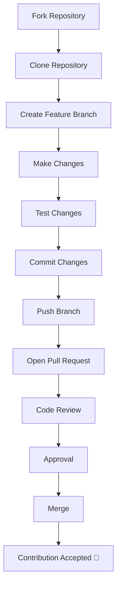

# Contributing to Smart Finance Dashboard

First of all, thank you for your interest in contributing to **Smart Finance Dashboard**! ❤️

Whether you're fixing a bug, improving the documentation, suggesting a feature, or submitting code, your contribution is greatly appreciated.

---

# 🚀 Contributor Journey

This guide will help you contribute to the project from start to finish.

---

# 📂 Project Structure

```text
Smart-Finance-Dashboard/
├── .github/          # GitHub workflows and templates
├── assets/           # Images, icons, logos, screenshots
├── docs/             # Project documentation
├── scripts/          # Utility scripts
├── src/              # Application source code
├── index.html        # Application entry point
├── README.md
├── CHANGELOG.md
├── CONTRIBUTING.md
├── CODE_OF_CONDUCT.md
├── SECURITY.md
└── LICENSE
```

---

# 🔧 Development Setup

## 1. Fork the repository

Click the **Fork** button on GitHub.

---

## 2. Clone your fork

```bash
git clone https://github.com/JohnkayFundz/Smart-Finance-Dashboard.git
```

---

## 3. Navigate into the project

```bash
cd Smart-Finance-Dashboard
```

---

## 4. Start a local development server

You can use any of the following:

- VS Code Live Server extension
- Python

```bash
python -m http.server
```

Or simply open `index.html` in your browser for basic testing.

---

# 🛠 Contribution Workflow

## Create a feature branch

```bash
git checkout -b feature/your-feature-name
```

Examples:

- `feature/dark-mode`
- `feature/budget-module`
- `fix/modal-focus`
- `docs/update-readme`

---

## Make your changes

- Keep changes focused on one feature or bug fix.
- Follow the project's coding standards.
- Update documentation if necessary.

---

## Test your changes

Before submitting:

- Verify new functionality works correctly.
- Ensure existing functionality still works.
- Check responsiveness on different screen sizes.
- Confirm there are no JavaScript console errors.

---

## Commit your changes

Use clear and descriptive commit messages.

Example:

```bash
git commit -m "feat: add budget progress indicator"
```

---

## Push your branch

```bash
git push origin feature/your-feature-name
```

---

## Open a Pull Request

Provide:

- A clear title
- A description of your changes
- Related issue numbers (if applicable)
- Screenshots for UI changes

---

# 📑 Coding Guidelines

Please follow these best practices:

- Write clean, readable code.
- Use semantic HTML.
- Follow consistent naming conventions.
- Keep functions focused on a single responsibility.
- Prefer reusable, modular JavaScript.
- Comment complex logic when necessary.
- Maintain accessibility best practices.
- Build responsive layouts for all screen sizes.

---

# ✅ Contributor Checklist

Before opening a Pull Request, please confirm:

- [ ] I have read the Code of Conduct.
- [ ] My code follows the project's coding style.
- [ ] I tested my changes thoroughly.
- [ ] I updated documentation where necessary.
- [ ] I checked for JavaScript console errors.
- [ ] My Pull Request focuses on a single feature or fix.

---

# 📝 Commit Message Guidelines

| Type | Description | Example |
|------|-------------|---------|
| `feat` | New feature | `feat: add budget progress indicator` |
| `fix` | Bug fix | `fix: correct balance rounding error` |
| `docs` | Documentation | `docs: update README` |
| `style` | Formatting changes | `style: improve dashboard spacing` |
| `refactor` | Code improvements | `refactor: modularize transaction logic` |
| `test` | Add or update tests | `test: add transaction filter tests` |
| `chore` | Maintenance | `chore: update project configuration` |

---

# 🐞 Reporting Bugs

Please include:

- Browser and version
- Operating system
- Steps to reproduce
- Expected behavior
- Actual behavior
- Screenshots (if applicable)

---

# 💡 Suggesting Features

Please include:

- Problem statement
- Proposed solution
- Expected benefits
- Optional screenshots or mockups

---

# 🤝 Pull Request Guidelines

Before requesting a review:

- Keep Pull Requests focused.
- Use descriptive titles.
- Link related GitHub Issues.
- Update documentation when needed.
- Ensure the application works correctly.
- Be open to feedback and revisions.

---

# 📜 Code of Conduct

By participating in this project, you agree to follow the project's **Code of Conduct**.

Please help us maintain a respectful, inclusive, and welcoming environment for everyone.

---

# 🔄 Contributor Workflow



---

# 💬 Need Help?

If you have questions, suggestions, or need help getting started:

- Open a GitHub Issue.
- Start a GitHub Discussion (if enabled).
- Review the project documentation in the `docs/` directory.

We're happy to help contributors of all experience levels.

---

# 📄 License

By contributing to this project, you agree that your contributions will be licensed under the same license as the project.

---

# 🎉 Thank You

Every contribution—whether it's fixing a typo, improving documentation, reporting a bug, or adding a new feature—helps make **Smart Finance Dashboard** better.

Thank you for being part of the project! ❤️
