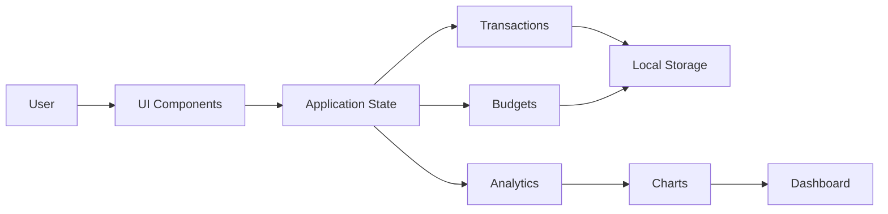

## 🤝 Contributing

Contributions are welcome!

Please read [CONTRIBUTING.md](CONTRIBUTING.md) before submitting pull requests.

Please also follow our [CODE_OF_CONDUCT.md](CODE_OF_CONDUCT.md).

## 📜 License

This project is licensed under the MIT License.

See the [LICENSE](LICENSE) file for details.

Smart-Finance-Dashboard/
│
├── assets/
├── css/
├── js/
│   ├── core/
│   ├── features/
│   ├── services/
│   └── shared/
├── index.html
├── README.md
└── LICENSE

## 🛠 Tech Stack

- HTML5
- CSS3
- JavaScript (ES6 Modules)
- Local Storage API
- Chart.js

- ## ♿ Accessibility

- Keyboard navigation
- Focus trapping
- ARIA labels
- Screen reader support
- Reduced motion support
- Semantic HTML

## ⚡ Performance

- Zero build tools
- No frameworks
- Fast page load
- Modular architecture
- Lightweight assets

- ## 🚀 Roadmap

- [x] Transaction Manager
- [x] Analytics Dashboard
- [x] Dark Mode
- [x] Responsive Layout
- [ ] Budget Planner
- [ ] CSV Export
- [ ] PDF Reports
- [ ] Multi-currency
- [ ] Recurring Transactions
- [ ] Cloud Sync

- [ ] ## 👨‍💻 Author

**John Kalumba**

- GitHub: https://github.com/JohnkayFundz
- Portfolio: https://johnkayfundz.github.io/portfolio-website/
- LinkedIn: https://www.linkedin.com/in/john-kalumba-96b437323/

- 
