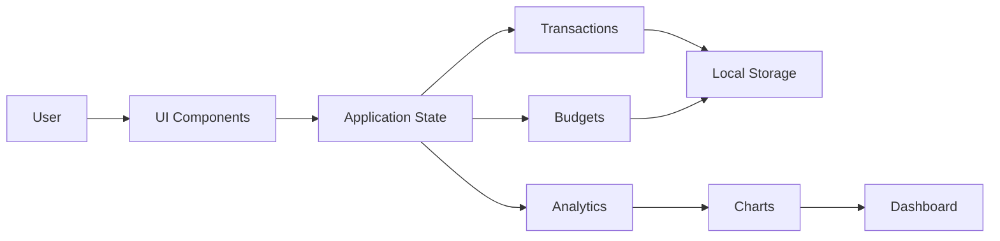

## 📑 Table of Contents

- [📸 Preview](#-preview)
- [🎥 Walkthrough](#-walkthrough)
- [🚀 Quick Start](#-quick-start)
- [🏗️ Architecture](#️-architecture)
- [✨ Features](#-features)
- [🛠️ Tech Stack](#️-tech-stack)
- [♿ Accessibility](#-accessibility)
- [⚡ Performance](#-performance)
- [🤝 Contributing](#-contributing)
- [📜 License](#-license)
- [👨‍💻 Author](#-author)

---

## 🚀 Quick Start

1. Clone the repository:

```bash
git clone https://github.com/JohnkayFundz/Smart-Finance-Dashboard.git
cd Smart-Finance-Dashboard
```

2. Open `index.html` in your preferred web browser.

3. Start tracking your finances.

---

## 🏗️ Architecture



---

## ✨ Features

### Current

- ✅ Transaction Management
- ✅ Analytics Dashboard
- ✅ Responsive Layout
- ✅ Accessible Modals
- ✅ Dark Mode

### Upcoming

- ⏳ CSV Export
- ⏳ PDF Reports
- ⏳ Budget Planner
- ⏳ Multi-Currency Support
- ⏳ Recurring Transactions
- ⏳ Cloud Sync

---

## 🛠️ Tech Stack

- HTML5
- CSS3
- JavaScript (ES6 Modules)
- Local Storage API
- Chart.js

---

## 🤝 Contributing

Contributions are welcome!

Please read [CONTRIBUTING.md](CONTRIBUTING.md) before submitting a pull request.

Please also follow our [CODE_OF_CONDUCT.md](CODE_OF_CONDUCT.md).

---

## 📜 License

This project is licensed under the MIT License.

See the [LICENSE](LICENSE) file for details.

---

## 👨‍💻 Author

**John Kalumba**

- 🌐 Portfolio: https://johnkayfundz.github.io/portfolio-website/
- 💻 GitHub: https://github.com/JohnkayFundz
- 💼 LinkedIn: https://www.linkedin.com/in/john-kalumba-96b437323/

---

⭐ If you found this project useful, consider giving it a **⭐ Star** on GitHub.

Made with ❤️ by **John Kalumba**.

## 📦 Installation

Clone the repository:

```bash
git clone https://github.com/JohnkayFundz/Smart-Finance-Dashboard.git
cd Smart-Finance-Dashboard
```

Open `index.html` in your preferred web browser to launch the application.

## 🛠️ Tech Stack

| Technology | Purpose |
|------------|---------|
| HTML5 | Semantic page structure |
| CSS3 | Responsive styling and layouts |
| JavaScript (ES6 Modules) | Application logic and interactivity |
| Local Storage API | Persistent client-side data |
| Chart.js | Financial charts and analytics |

## 📂 Project Structure

```text
Smart-Finance-Dashboard/
├── assets/
├── css/
├── js/
│   ├── core/
│   ├── features/
│   ├── services/
│   └── shared/
├── index.html
├── README.md
└── LICENSE
```

## ♿ Accessibility

- Keyboard navigation
- Focus management
- Focus trapping in modals
- ARIA labels and roles
- Semantic HTML
- Reduced motion support

- ## ⚡ Performance

- Lightweight and framework-free
- Modular ES6 architecture
- Fast loading
- Minimal dependencies
- Client-side storage

- ## 🎯 About

Smart Finance Dashboard is a frontend portfolio project built to demonstrate modern JavaScript development, responsive design, accessibility best practices, and a clean application architecture, all without relying on external frameworks.

## 🌐 Live Demo

🔗 https://johnkayfundz.github.io/Smart-Finance-Dashboard/
