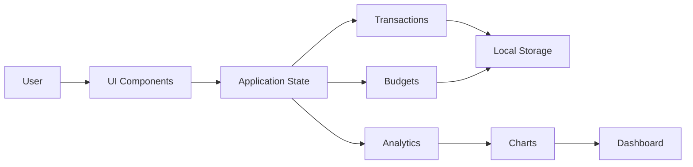

# 💰 Smart Finance Dashboard

> A modern, responsive personal finance dashboard built with **HTML5, CSS3, and Vanilla JavaScript**.


Track income and expenses, visualize financial data, and manage your finances through a clean, accessible, and responsive interface.

---

## 🌐 Live Demo

[](https://johnkayfundz.github.io/Smart-Finance-Dashboard/)

---

## 📸 Preview


---

## 🎥 Walkthrough

### ➕ Add Transactions


### 📊 Analytics Dashboard


### 🌙 Dark Mode


### 📱 Responsive Layout


---

## 📑 Table of Contents

- [🎯 About](#-about)
- [✨ Features](#-features)
- [📋 Requirements](#-requirements)
- [🌍 Browser Support](#-browser-support)
- [📦 Installation](#-installation)
- [🚀 Quick Start](#-quick-start)
- [🏗️ Architecture](#-architecture)
- [📂 Project Structure](#-project-structure)
- [🛠️ Tech Stack](#-tech-stack)
- [♿ Accessibility](#-accessibility)
- [⚡ Performance](#-performance)
- [🚀 Roadmap](#-roadmap)
- [🙏 Acknowledgements](#-acknowledgements)
- [🤝 Contributing](#-contributing)
- [📜 License](#-license)
- [👨‍💻 Author](#-author)
- [⭐ Support](#-support)

---

## 🎯 About

Smart Finance Dashboard is a modern frontend application built with **Vanilla JavaScript**, **HTML5**, and **CSS3**.

The project demonstrates:

- Responsive Web Design
- Modular JavaScript Architecture
- Accessibility Best Practices
- Local Storage Persistence
- Interactive Financial Analytics
- Maintainable and Scalable Code

The goal is to showcase practical frontend engineering without relying on external frameworks.

---

## ✨ Features

### ✅ Current Features

- Income & Expense Tracking
- Transaction History
- Financial Summary Cards
- Interactive Analytics Dashboard
- Expense Charts
- Search & Filter
- Local Storage Persistence
- Dark Mode
- Responsive Design
- Accessible Modal Dialogs

### 🚀 Planned Features

- Budget Planner
- CSV Export
- PDF Reports
- Multi-Currency Support
- Recurring Transactions
- User Authentication
- Cloud Synchronization

---

## 📋 Requirements

- Modern Web Browser
- No installation required
- No backend server required

---

## 🌍 Browser Support

| Browser | Supported |
|----------|:---------:|
| Chrome | ✅ |
| Edge | ✅ |
| Firefox | ✅ |
| Safari | ✅ |

---

## 📦 Installation

Clone the repository.

```bash
git clone https://github.com/JohnkayFundz/Smart-Finance-Dashboard.git
cd Smart-Finance-Dashboard
```

Open `index.html`.

---

## 🚀 Quick Start

1. Clone the repository.
2. Open `index.html`.
3. Add income and expense transactions.
4. View analytics.
5. Switch between Light and Dark Mode.
6. Data is automatically saved using Local Storage.

---

## 🏗️ Architecture



---

## 📂 Project Structure

```text
Smart-Finance-Dashboard/
│
├── assets/
│   ├── preview.png
│   ├── transactions.gif
│   ├── analytics.gif
│   ├── darkmode.gif
│   └── responsive.gif
│
├── css/
│
├── js/
│   ├── core/
│   ├── features/
│   ├── services/
│   └── shared/
│
├── index.html
├── README.md
├── LICENSE
├── CONTRIBUTING.md
└── CODE_OF_CONDUCT.md
```

---

## 🛠️ Tech Stack

| Technology | Purpose |
|------------|---------|
| HTML5 | Semantic page structure |
| CSS3 | Responsive layouts and styling |
| JavaScript (ES6 Modules) | Application logic |
| Local Storage API | Persistent client-side storage |
| Chart.js | Interactive financial charts |

---

## ♿ Accessibility

- Semantic HTML
- Keyboard Navigation
- Focus Management
- Focus Trapping
- ARIA Labels
- Screen Reader Support
- Reduced Motion Support

---

## ⚡ Performance

- Lightweight Framework-Free Architecture
- Modular ES6 JavaScript
- Fast Initial Load
- Optimized DOM Updates
- Minimal Runtime Dependencies
- Efficient Local Storage Usage

---

## 🚀 Roadmap

- [x] Transaction Management
- [x] Dashboard Analytics
- [x] Responsive Design
- [x] Dark Mode
- [x] Local Storage
- [x] Accessible Modal Dialogs
- [ ] Budget Planner
- [ ] CSV Export
- [ ] PDF Reports
- [ ] Multi-Currency Support
- [ ] Recurring Transactions
- [ ] Cloud Synchronization
- [ ] User Authentication

---

## 🙏 Acknowledgements

- **Chart.js** for financial data visualization.
- **GitHub Pages** for hosting the live demo.
- **Shields.io** for dynamic project badges.

---

## 🤝 Contributing

Contributions are welcome!

1. Fork the repository.
2. Create a feature branch.
3. Commit your changes.
4. Push your branch.
5. Open a Pull Request.

Please read **CONTRIBUTING.md** before contributing.

Please follow our **CODE_OF_CONDUCT.md**.

---

## 📜 License

This project is licensed under the **MIT License**.

See the **LICENSE** file for details.

---

## 👨‍💻 Author

**John Kalumba**

🌐 Portfolio  
<https://johnkayfundz.github.io/portfolio-website/>

💻 GitHub  
<https://github.com/JohnkayFundz>

💼 LinkedIn  
<https://www.linkedin.com/in/john-kalumba-96b437323/>

---

## ⭐ Support

If you found this project useful, consider giving it a ⭐ on GitHub.

Your support helps improve the project and encourages future development.

---

> Built with ❤️ using **HTML5**, **CSS3**, and **Vanilla JavaScript**.

© 2026 John Kalumba
